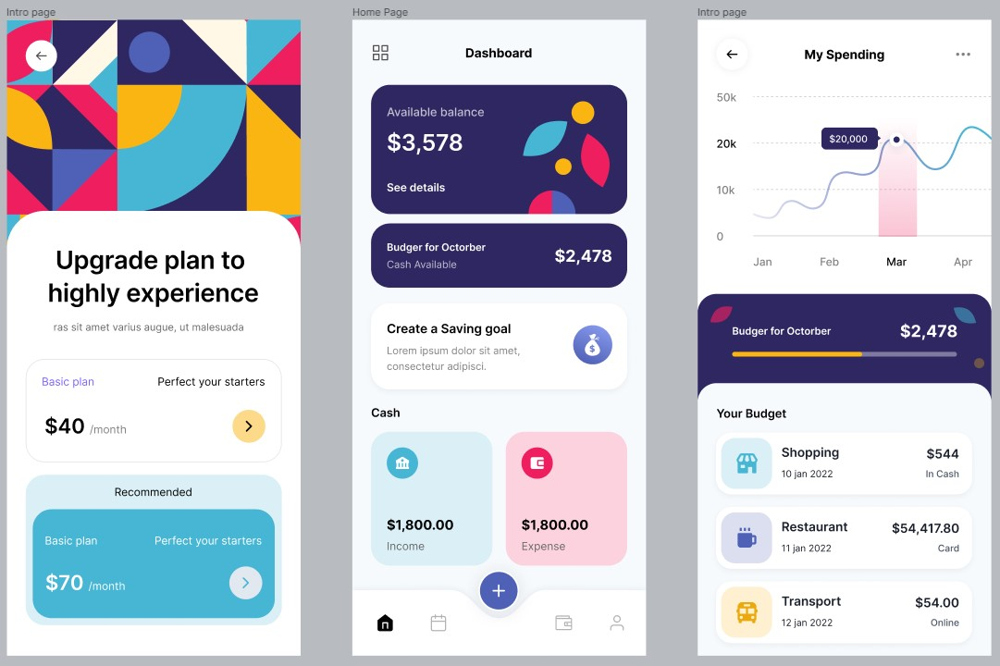

# Flutter-Finance-App-UI

The user interface is made on Flutter based on this [template](https://www.figma.com/file/ybwUQJ20aUh11uGjCMhjrh/Budget-planer-app-%26-Finance-App-(Community)?node-id=1022%3A299&t=S1RoV3tjEzBptfkp-0)

     

## Getting Started

This project is a starting point for a Flutter application.

A few resources to get you started if this is your first Flutter project:

- [Lab: Write your first Flutter app](https://docs.flutter.dev/get-started/codelab)
- [Cookbook: Useful Flutter samples](https://docs.flutter.dev/cookbook)

For help getting started with Flutter development, view the
[online documentation](https://docs.flutter.dev/), which offers tutorials,
samples, guidance on mobile development, and a full API reference.
